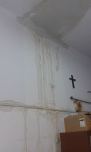

# The disaster

## Abstract
In this chapter I will tell the story about the big disaster that happened in the hospital, loosing ca 70% of their beds (aka possibility to make money). At the same time they didn't have the a valid operational permit, they underpaid their staff and even before the disaster the didn't make enough money.

There will also be a section in which I will set the stage, shortly (5-6 pages), tell about the people involved and what I did there. Also a little bit about the history.  

## Topics taught / talked about in this chapter
This chapter sets the stage for the rest of the book and pretty short... but dramatic

# Introduction
As I walked into the hospital lobby this morning I was struck by two things; a vial stench of mold and moist, and at least 4 buckets to collect the water dripping down from roof, from the second floor. 

Immediately I turn around and walk out again, just 10 meters to get a better view; Oh Lord - the roof is still not on. It's just empty scaffolding - just as when I last was at the hospital 2 weeks ago. My mind struggles to make sense of the situation; but ... it's been raining at least one hour per day the last week...

I rush back into the hospital and start to go around the bottom floor, my eyes fixed on the roof. There's big wet stains covering several square meters, black mold in the roof and water running down the walls. I stopped to count the buckets put out throughout the hospital as I passed number 20. 

At one place, right outside the nursery for the newly delivered babies a big tarp is suspended to catch the water and lead it down to a big barrel. The barrel is half-full now and it's dripping constantly. 

First at this point it strikes me that I have to check the second floor. With my mouth still gaping I walk slowly towards the covered up door that the construction workers has used as access. I meet some of the hospital staff but they look away or past me. 

Once I enter through the narrow passage, up to the second floor I just drop to my knees. Without really knowing why I start to cry. The scene before me looks like something after a flood. But this is on the second floor. Everything, everything is covered in debris, dirt, broken roof tiles and water is soaking everything. 

I look up - open sky. And the rain is coming. I continue to walk through the corridors and wards and realize that I might be the first one from the hospital that is up here. No one else knows about the scope of this problem. There were some construction workers climbing around on the scaffolding but just a few. 

The area not covered with any roof constitutes ca 40% of the area of the second floor, but worse than this it's about 65% of the beds in the hospital. 

I start to document as much as I can using my phone but in my mind only one thought runs over and over again

>The hospital has died - there's no coming back from this.

## Adding problems to the pile

This disaster was really bad in itself but the hospital had more problems to tackle that had been uncovered during the last months before the disaster with the roof happened. 

Let's back up a few months and take in the full situation of how this hospital was doing... right up to the point when I walked into the lobby that morning in July 2014.

The challenges we were facing was enormous:

The hospital had not renewed their **operational permit** in over 1 year. The Health Department of the Indonesian government had given a temporary permit to continue to run the hospital under one condition; we had to follow the Standard Operating Procedures (SOP) to the bullet. Failing to do so had the hospital risking medical malpractice and severe fines. At this point the SOPs were not well communicated. 

The hospital were **loosing money per month**. Quite simply we didn't treat enough patients in the hospital. The hospital had a 5-15 patients in their beds per day on average at this time. The total number of beds in the hospital was 55. Meaning that the BOR [^BOR] was about 15-20%. No one really knew what the hospital needed but for most hospitals 60-70% is considered a good level of occupancy.

This was the end of a downward trend that, actually, had gone on for years. At the time for the roof disaster the hospital **couldn't pay the salary** for the staff on time, bills for operating expenses such as medicine, nor **the fees for the doctors**. The hospital were desperately borrowing from other accounts, delaying payments or at several occasions HR staff were paying out of their own pocket. 

Needless to say morale among the staff was low, bottom-of-the-sea-level. Not only where they facing unfathomable challenges but also they have had many months, if not years, of too little to do. 

This is the situation this hospital were in as I enter the lobby that morning. In fact I was there to try to help them to get moving on getting the operational permit. Together with my team we had identified this as the biggest risk. That is until the roof fell in. 

Let's get back to that morning. I'm sad to say that the horrid introduction is not yet over.

## Taking action
After being in some kind of chock I found my senses and hurried down the covered up door to the first floor. I needed to talk to someone; what was being done, what was the plan? How could this have happen?

I rush through the hospital and meet Dr Lillian the director. She doesn't look particular upset, a bit tiered maybe. After her came the Salvation Army Officer of the hospital Major Sih Laua. No trace of being upset there either. 

My fear was correct; they didn't know. As I try to tell them I also notice that there's actually a few patients in the hospital. This scares me and I'm starting to wonder if the second floor is stable or on the verge to collapse. 

Frantically I start to explain for Dr Lillian and Major Laua about the situation, stumbling through the sentences and mixing English, Indonesian and Swedish on the way. I show them the roof, I show the the water dripping down the walls and we open the doors to offices where the mold stench almost can be touched. 

They seem surprised now. I ask them if they have been on the second floor, but they have not. I ask to go there and then I start to run. I run back to my team. Even though it's 400 meter uphill and already about 30 C outside I don't stop once. 

Once in the office I describe the situation for the team and they are appalled. We hold a short meeting and decide to inform the leaders of the Salvation Army in Indonesia that we are taking action. 

We hold a quick meeting and start by stating our priorities for the situation and the work ahead; 

1. Patient safety
2. Staff safety
3. Start to make money again

We also make a short-term action plan consisting of the absolute emergency things we need to do. I'm given the "Clean up second floor" task and hurries back to the hospital. At this point nothing has been done to clear up the water filled debris that is soaking the floor of the second floor. Which in turn causes mold, leaking and damages to the wall. 

Other things we are considering at this point is the insurance situation for operating the hospital under these conditions and the contract / responsibility of the builders. 

As I go back up to the second floor I'm still wearing my nice shoes and the Salvation Army uniform. "No time to change" is all can think and grab one of two (!) shovels that are present on the premises. I walk up to the second floor, walks into the closest room, that used to be a ward with patients now covered in moist debris, and I start to dig. 

A janitor that doesn't speak a single word of English joins me and with my stumbling Indonesian we start to clear the room, bucket by bucket. After three hours we can see the floor of ca 20% of the room. You can see the picture to the right. 

We realize that this will take too long time to clean up. Something else needs to be done. Also, the sun is setting and soon we can't see where we are walking. We quit for the day and I walk back home. 

It's a heavy day and the thought from the morning comes back to me:

>The hospital is dead. We will never rise again  

[^BOR]: Bed Occupancy Rate
